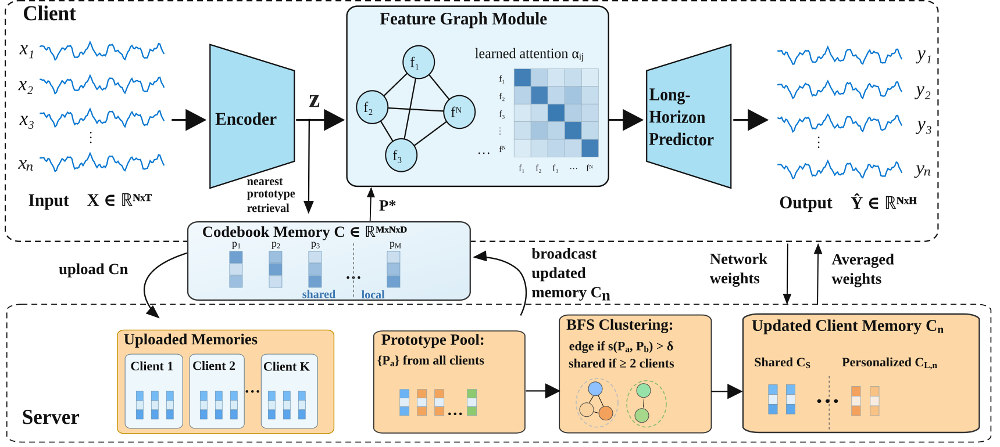

# FedRLMem: Federated Representation Learning with Memory for Fault Detection and Localization in Robotic and Automated Fleets

Official implementation accompanying the paper *"Federated Representation Learning with Memory for Fault Detection and Localization in Robotic and Automated Fleets"* (manuscript in `report/`).

**Yongxu Ren<sup>1</sup>, Junfu Zhang<sup>1</sup>, Felix Deichsel<sup>2</sup>, Jürgen Seiler<sup>2</sup>, André Kaup<sup>2</sup>, Philipp Beckerle<sup>1</sup>**
<sup>1</sup>Chair of Autonomous Systems and Mechatronics, FAU Erlangen-Nürnberg &nbsp;·&nbsp; <sup>2</sup>Chair of Multimedia Communications and Signal Processing, FAU Erlangen-Nürnberg

[BibTeX](#citation)

---

## Abstract

Reliable fault monitoring in robotic and automated fleets is hindered by scarce fault labels, distributed data, and varying operating conditions. We propose **FedRLMem**, an unsupervised federated representation learning framework with memory for fault detection and localization using only fault-free operation data. Each client learns latent representations, while a discrete prototype memory captures recurring operating states; cross-client prototype alignment further forms shared and personalized fleet memories without exchanging raw data or sample-level embeddings. Faults are detected from complementary feature, prediction, and joint deviations, while feature-level deviations support localization. We evaluate FedRLMem on our mobile-robot fleet (**MoboFleet**) and three public datasets covering roller bearings, drones, and industrial manipulators. On MoboFleet, FedRLMem achieves an AUROC of 0.953 and an AUPRC of 0.984, together with Top-3 localization accuracy above 94% for all fault types. Results on the public datasets demonstrate cross-platform generalizability, while non-IID experiments show robustness to imbalanced data volumes and operating environments.

## Overview

<p align="center">
  
</p>

Each client encodes multivariate sensor time series with a shared encoder, models inter-feature dependencies through an attention-based graph predictor (GDN-style forecasting), and maintains a local discrete prototype memory (VQ-VAE-style codebook) over complete operating states. Only the local codebook and per-prototype usage counts — never raw data or sample-level embeddings — are uploaded to the server, which performs cross-client prototype alignment (cosine-similarity graph + single-linkage BFS clustering) to build a fleet-wide shared memory that is broadcast back alongside the FedAvg'd encoder/predictor weights, while personalized local prototypes are preserved. At inference, faults are scored from three complementary signals:

- **Feature deviation (FD)** — per-node distance to the matched prototype
- **Joint deviation (JD)** — Mahalanobis distance over the full deviation vector, capturing correlated multi-feature drift
- **Prediction deviation (PD)** — graph-attention forecast residual

FD and JD support both detection and localization; FD+PD+JD are fused via adaptive softmax weighting for the final anomaly score.

## Highlights

| Dataset | Metric | FedRLMem (ours) | Best unsupervised baseline |
|---|---|---|---|
| MoboFleet (4 iRobot Create 3, 4 fault types) | AUROC / AUPRC | **0.954** / **0.984** | 0.885 (FedAvg) |
| PUBearing (6 roller bearings) | AUROC | **0.998** | 0.845 (uFedHy) |
| ALFA (drone faults, 6 clients) | AUROC | 0.892 | 0.925 (IFCA) |
| ME-AD (16 manipulator tasks) | AUROC | **0.828** | 0.631 (IFCA) |

- Unsupervised training on fault-free data only; no fault labels required.
- Top-3 fault-localization accuracy > 94% for every MoboFleet fault type (99.9% for load dragging), rivaling supervised references (FedPRO, FedCPG).
- Robust to non-IID client partitions: AUROC stays within 0.91–0.95 under data-volume skew and 0.93–0.95 under operating-environment skew (natural: 0.954).
- Cross-client prototype alignment threshold `δ` and shared-memory ratio `γ` have limited sensitivity (< 0.06 AUROC swing across `δ ∈ [0.1, 0.9]`).

Full tables and ablations are in the paper's experiment section (LaTeX source not tracked in this repo).

## Repository Structure

```
FLMemGraph/
├── src/
│   ├── models/            joint_prototype_model.py (encoder, prototype memory, forecast head),
│   │                      baseline_models.py
│   ├── federated/         FedRLMem's own methodology only: federated_train_eval.py (shared
│   │                      train/eval round loop + B/H/K scoring), federated_memory.py
│   │                      (cross-client prototype alignment, `align_and_split`),
│   │                      pipeline.py (single entry point), comm_cost.py (communication
│   │                      accounting, shared instrumentation)
│   ├── dataloaders/       one folder per dataset (robo_fleet, paderborn, alfa, me_ad):
│   │                      raw→windowed builder/adapter + the loader that reads the
│   │                      built (data.npy, targets.npy, metadata.json, partition.pkl)
│   └── plots/             figure-generation scripts
├── benchmark/
│   ├── run_<dataset>_bck_federated.py   main entry point per dataset (MoboFleet, PUBearing/
│   │                                     paderborn, ALFA, ME-AD); also drives every baseline
│   │                                     via `--baseline {fedavg,ifcaae,fedexdnn,fedpro,fedcpg,ufedhy}`
│   ├── FedAvg/, IFCAAE/, Fed-ExDNN/, FedPRO/, FedCPG/, uFedHy-DisMTSADD/
│   │                                     one folder per baseline: its own algorithm module
│   │                                     (FedPRO/fedpro.py, FedCPG/fedcpg.py, uFedHy-DisMTSADD/
│   │                                     ufedhy.py; FedAvg/IFCAAE/Fed-ExDNN's aggregation lives
│   │                                     inline in federated_train_eval.py's mode dispatch instead,
│   │                                     since it's the same shared round loop as `ours`),
│   │                                     thin per-dataset CLI runners, and a README
│   ├── diagnose_<dataset>_localization_federated.py   Top-k localization evaluation
│   ├── experiment_*.py, sweep_*.py       hyperparameter grids (memory size M, δ, γ) and
│   │                                     non-IID sensitivity sweeps (quantity/scenario skew)
│   └── compare_baselines.py
├── data/                   raw + preprocessed datasets (not tracked in git, see below)
├── checkpoints/            trained weights + JSON evaluation reports, one folder per dataset
├── report/                 IEEE-conference LaTeX source, figures, and compiled PDF
└── docs/                   design notes and background material
```

## Installation

Python ≥ 3.10 is recommended.

```bash
git clone <repo-url> FLMemGraph
cd FLMemGraph
python3 -m venv .venv && source .venv/bin/activate
pip install torch numpy pandas scipy scikit-learn matplotlib
```

There is no accelerator-specific requirement; install the `torch` build matching your CUDA/CPU setup from [pytorch.org](https://pytorch.org/get-started/locally/).

## Datasets

`data/` is git-ignored except for `data/robo_fleet/` (MoboFleet, this project's own published dataset, tracked directly). The other three datasets are built once from their raw source into a standard `(data.npy, targets.npy, metadata.json, partition.pkl)` layout, or loaded on the fly, via the loader under `src/dataloaders/<dataset>/`:

| Dataset | Description | Loader / builder |
|---|---|---|
| **MoboFleet** | 4 iRobot Create 3 units, 26 ROS 2-topic features, 4 induced mechanical faults (caster-wheel jam, load dragging, wheel-cable entanglement, thumbtack obstruction), 2 operating environments — collected for this work, tracked in `data/robo_fleet/` | `src/dataloaders/robo_fleet/build_robo_fleet.py` (from `data/robo_pdm/`) |
| **PUBearing** | Paderborn University roller-bearing dataset, 6 bearings, healthy/inner-ring/outer-ring damage | `src/dataloaders/paderborn/paderborn_adapter.py` (reads raw `.mat` files directly, no build step) |
| **ALFA** | UAV (drone) fault dataset, 6 fault-type client groups | `src/dataloaders/alfa/build_alfa.py` |
| **ME-AD** | Industrial manipulator anomaly dataset, 16 clients (one per task) | `src/dataloaders/me_ad/me_ad_adapter.py` (reads directly from the downloaded `ME-AD.zip`, no build step) |

Run the corresponding builder before training on a dataset for the first time (skip for PUBearing/ME-AD, which load raw data directly); see each `run_*_bck_federated.py` module docstring for exact steps.

## Reproducing the Results

Each `benchmark/run_<dataset>_bck_federated.py` script shares the same federated train/eval loop (`src/federated/federated_train_eval.py`) and reports the `B` (feature deviation), `H` (joint/Mahalanobis deviation), `K` (prediction deviation), and fused `BHK` detection scores as a JSON report under `checkpoints/<dataset>/`.

```bash
# MoboFleet (own fleet dataset used in the paper's main results)
python3 benchmark/run_robo_fleet_bck_federated.py

# PUBearing
python3 benchmark/run_paderborn_bck_federated.py

# ALFA
python3 src/dataloaders/alfa/build_alfa.py          # once
python3 benchmark/run_alfa_bck_federated.py

# ME-AD
python3 benchmark/run_me_ad_bck_federated.py

# Fault localization (Top-k accuracy)
python3 benchmark/diagnose_robo_fleet_localization_federated.py

# Baseline comparison (FedAvg, IFCA, Fed-ExDNN, uFedHy; FedPRO/FedCPG as supervised references)
python3 benchmark/compare_baselines.py
```

Common flags across scripts: `--horizon-mult M` (forecast horizon multiplier), `--num-prototypes N` (memory size `M`), `--out-suffix NAME` (report tag), `--baseline {ours,fedavg,ifcaae,fedexdnn,fedpro,fedcpg,ufedhy}` where supported. Run any script with `--help` for the full list.

Hyperparameter and non-IID sensitivity sweeps used for the paper's figures/tables (prototype-budget grid search, linkage-threshold `δ`, quantity-/scenario-skew) are under `benchmark/experiment_*.py` and `benchmark/sweep_*.py`.

## Citation

If you use this code or the MoboFleet dataset, please cite:

```bibtex
@inproceedings{ren2026fedrlmem,
  title     = {Federated Representation Learning with Memory for Fault Detection and Localization in Robotic and Automated Fleets},
  author    = {Ren, Yongxu and Zhang, Junfu and Deichsel, Felix and Seiler, J\"urgen and Kaup, Andr\'e and Beckerle, Philipp},
  booktitle = {(manuscript in preparation)},
  year      = {2026}
}
```

## Acknowledgment

This work was supported by the Bayerische Transformations- und Forschungsstiftung under grant no. AZ-1586-23.
